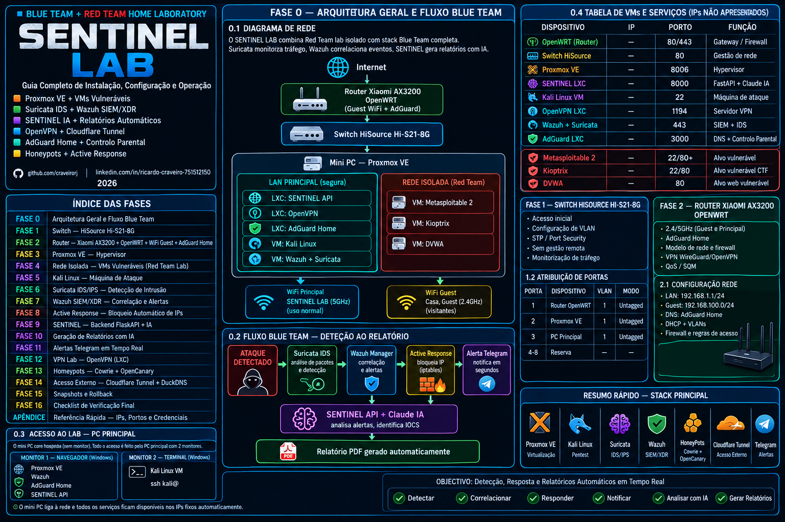

# 🛡️ SENTINEL LAB

> **Blue Team + Red Team Home Laboratory**  
> Detecção, Resposta e Relatórios Automáticos com IA em Tempo Real

---

## 📋 Sobre o Projecto

O **SENTINEL LAB** é um laboratório de cibersegurança doméstico completo, construído sobre Proxmox VE, que combina um ambiente isolado de Red Team com uma stack Blue Team profissional. O objectivo é praticar pentesting em máquinas vulneráveis enquanto se monitoriza e responde aos ataques em tempo real.

### O que este lab permite fazer

- **Red Team** — atacar máquinas vulneráveis num ambiente completamente isolado
- **Blue Team** — detectar ataques com Suricata IDS + Wazuh SIEM/XDR
- **Active Response** — bloquear IPs atacantes automaticamente via iptables
- **IA integrada** — analisar alertas e gerar relatórios de incidentes com Claude AI
- **VPN** — aceder ao lab remotamente de qualquer lado (ideal para demonstrações)

---

## 🏗️ Arquitectura
